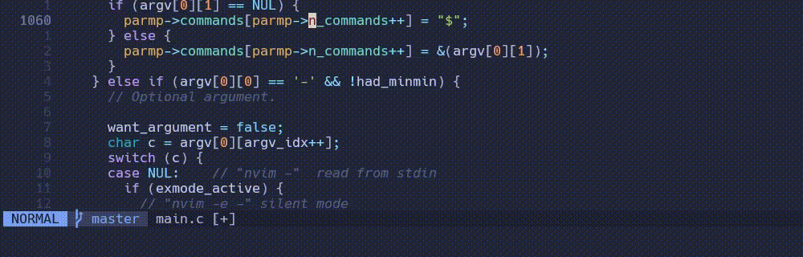

<div align="center">
    <h1>printf.nvim</h1>
    <h5>A smarter print debugging statement generator for C/C++</h5>
</div>



*Note: This project is a work-in-progress - please expect breaking changes!*

## Features

- Generates print statements for printing line numbers, function names and variable values
- Can instantly remove all generated print statements
- Syntax and context aware - doesn't just use the word under the cursor to print a variable
- Automatically inserts format specifiers for all standard C types
- Customizable function call (see the Examples section for inspiration)

## Requirements

- Neovim >= 0.8.0
- A tree-sitter parser for C
- The clangd language server

## Installation

### lazy.nvim

```lua
{
    'declancm/printf.nvim',
    dependencies = { 'nvim-treesitter/nvim-treesitter' }
}
```

## Configuration

```lua
require('printf').setup({
    -- Keymap options
    keymaps = {
        -- Enable the default keymaps
        defaults = true,
    },
    -- Generated function call options
    called_function = {
        -- Name of the called function
        name = 'printf',
        -- Add additional arguments before the format string
        additional_args = {},
    },
    -- print_var specific options
    print_var = {
        -- Automatically dereference supported pointer types
        dereference_pointers = false,
        -- Format char * variables as strings
    },
        char_ptr_strings = true,
    -- print_line specific options
    print_line = {
        -- The variable/identifier/macro with the line number integer value
        variable = '__LINE__',
    },
    -- print_func specific options
    print_func = {
        -- The variable/identifier/macro with the function name string
        variable = '__func__',
    },
})
```

## Usage

### Default Keymaps

#### Normal Mode

- **\<leader\>dv** - Print the variable under the cursor
- **\<leader\>dl** - Print the line number
- **\<leader\>df** - Print the enclosed function name
- **\<leader\>dc** - Remove all the generated statements

### Lua API

```lua
require('printf').print_var()   -- Print the variable under the cursor
require('printf').print_line()  -- Print the line number
require('printf').print_func()  -- Print the enclosed function name
require('printf').clean()       -- Remove all the generated statements
```

## Examples

### Minimal Neovim Config

```lua
-- Install plugins
require('lazy').setup({
    'neovim/nvim-lspconfig',
    { 'nvim-treesitter/nvim-treesitter', build = ':TSUpdate' },
    'declancm/printf.nvim'
})

-- Make sure the tree-sitter parser for c is installed
require('nvim-treesitter.configs').setup({ ensure_installed = { 'c', 'cpp' } })

-- Setup the clangd language server
require('lspconfig').clangd.setup({})

-- Setup printf.
require('printf').setup()
```

### Standard Error Stream

**Config:**

```lua
require('printf').setup({
    called_function = {
        name = 'fprintf',
        additional_args = { 'stderr' }
    }
})
```

**Output:**

```c
fprintf(stderr, "example: %d\n", example); // auto-generated printf
```

### Pretty Function

**Config:**

```lua
require('printf').setup({
    print_func = { variable = '__PRETTY_FUNCTION__' }
})
```

**Output:**

```c
printf("function: %s\n", __PRETTY_FUNCTION__); // auto-generated printf
```
